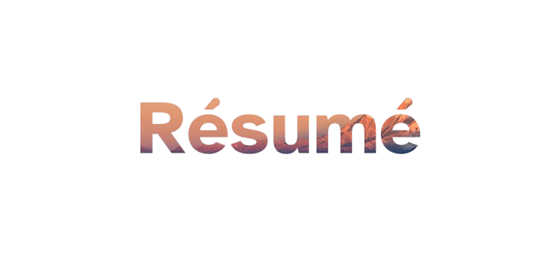

  

    Powered by <a href="https://github.com/wtfjoke/setup-tectonic">wtfjoke/setup-tectonic</a>

## Project Overview

This project uses Overleaf git sync, allowing using the Overleaf editor and syncing the changes to the git repository. The LaTeX is compiled and rendered automatically via the setup-tectonic GitHub action, and deployed to the web via Vercel, hosted at cv.felipecustodio.dev
